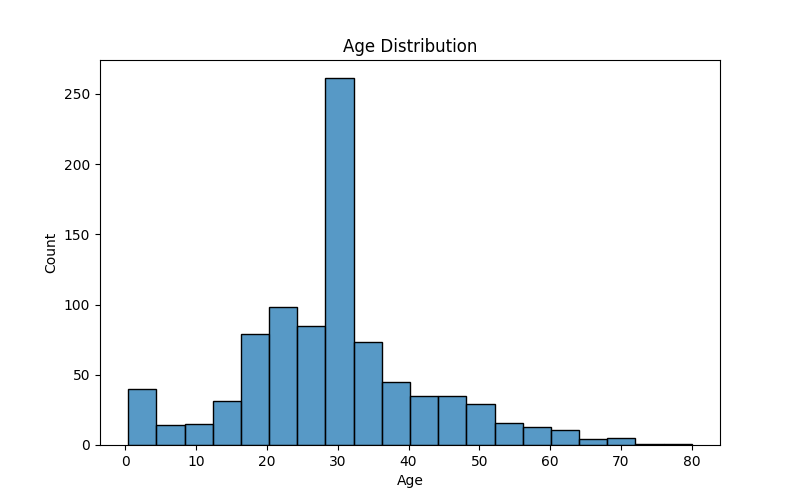
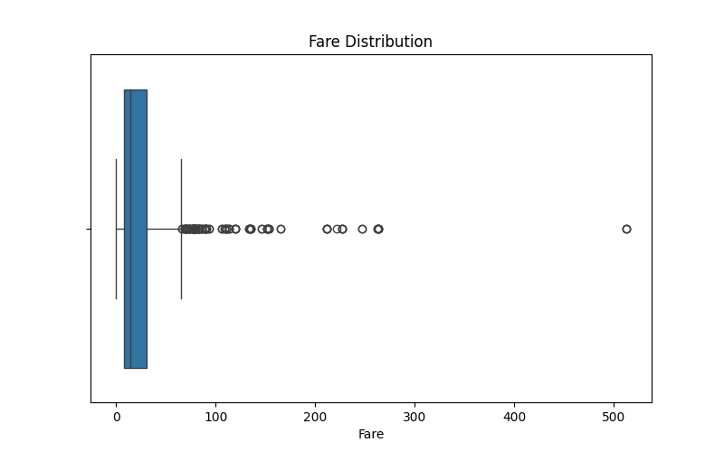
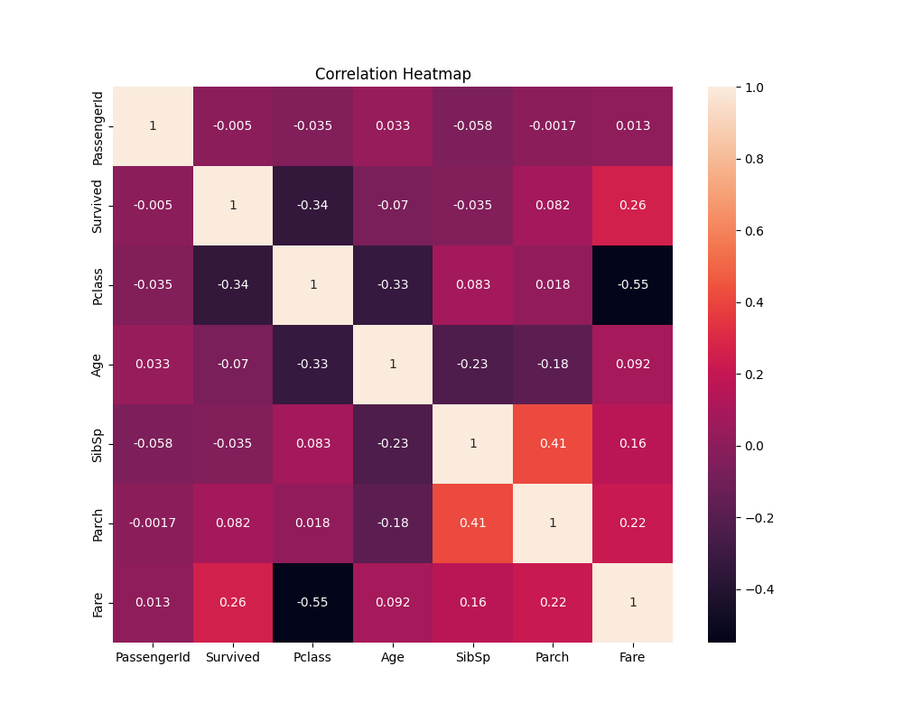

# Data Cleaning & Visualization Project

## Objective
This project focuses on cleaning a raw dataset and visualizing insights using Python.

## Tools and Libraries Used
- Python
- Pandas
- NumPy
- Matplotlib
- Seaborn

## Data Cleaning Steps
- Handled missing values
- Removed duplicate records
- Explored dataset statistics

## Visualizations
### Histogram

### Boxplot

### Correlation Heatmap

## Files Included
- data_cleaning.ipynb
- cleaned_dataset.csv
- histogram.png
- boxplot.png
- heatmap.png
- requirements.txt

## Author
**Asifa Firdhouse**
